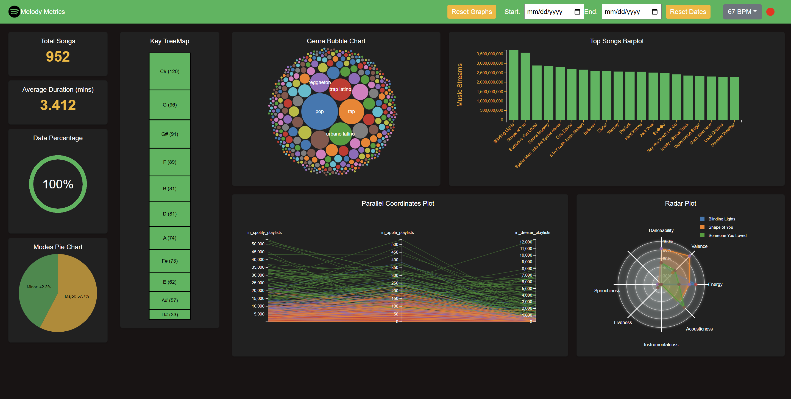

### Melody Metrics: A Music Analytics Dashboard



#### Overview
**Melody Metrics** is a dynamic and interactive music analytics dashboard that visualizes patterns in music consumption across platforms like Spotify and Apple Music. Built using the **Spotify2023 dataset** and real-time data fetched from Spotify's API, the dashboard provides actionable insights for music professionals by highlighting trends in genres, song popularity, and audio features.

---

#### Key Features
- **Interactive Charts**:
  - **Min/Major Pie Chart**: Distribution of songs in minor vs. major tonalities.
  - **Top Streams Bar Chart**: Top 20 songs by stream count with detailed interactivity.
  - **Genres Bubble Chart**: Bubble chart showing genre prevalence with clickable filters.
  - **Audio Radar Plot**: Multidimensional comparison of audio features.
  - **Vertical TreeMap of Keys**: Proportional display of song keys with filtering options.
  - **Platform Comparison PCP**: Parallel coordinates plot for cross-platform comparisons.
  - **Date and BPM Filters**: Dynamic filtering of data by date range and tempo.

- **Insights**:
  - Danceable, energetic, and acoustic songs tend to have higher streams.
  - Pop, rap, and urban latino genres show exponential growth in popularity.
  - Happy songs in major scales are streamed more frequently.

---

#### Tech Stack
- **Backend**: Flask
- **Frontend**: Bootstrap and D3.js for interactive visualizations
- **Data**: Spotify2023 dataset (Kaggle) and Spotify API

---

#### Installation
1. Clone the repository:
   ```bash
   git clone https://github.com/username/melody-metrics.git
   ```
2. Run the server:
   ```bash
   python server.py
   ```
4. Access the dashboard at `http://localhost:5000`.
